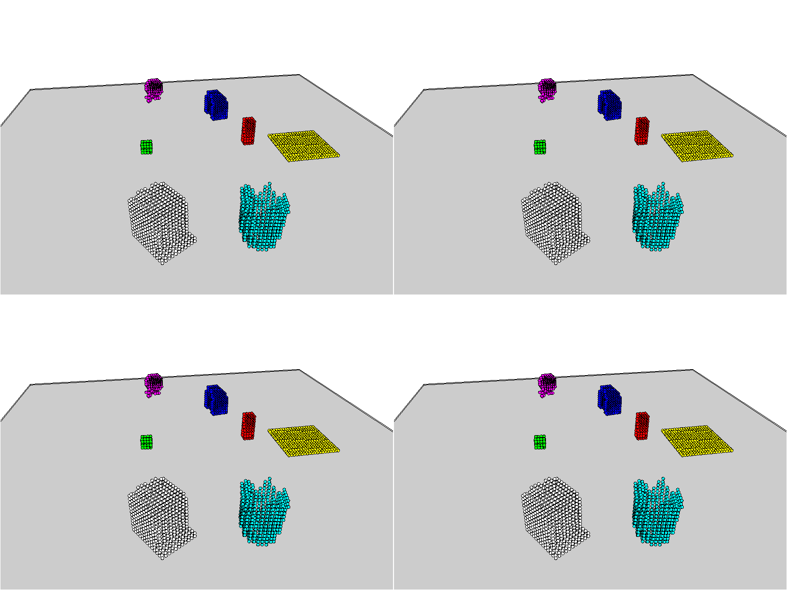
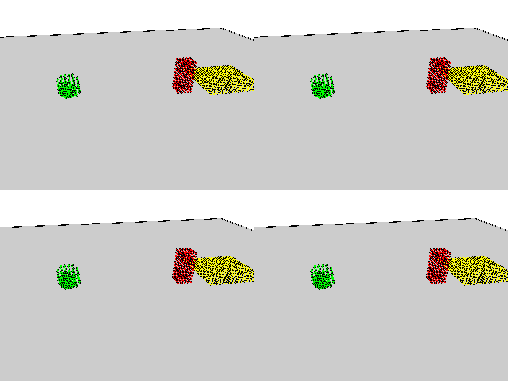

# MDPI, a memoried verision of DPI-Net by combining memory cell technique from LSTM

Student: Mingyu Sheng

UID: u7376801

Supervisors: Dr. Peng Zhang, Dr. Cheng Xue


This work is based on DPI-Net from https://github.com/htung0101/Physion-particles.git

Contact: mingyu.sheng@anu.edu.au (Mingyu Sheng)

<!-- ## Papers of DPI-Net:

** Learning Particle Dynamics for Manipulating
Rigid Bodies, Deformable Objects, and Fluids ** [[website]](http://dpi.csail.mit.edu/) [[paper]](http://dpi.csail.mit.edu/dpi-paper.pdf)

Yunzhu Li, Jiajun Wu, Russ Tedrake, Joshua B. Tenenbaum, Antonio Torralba ** -->

## Demo

Rollout from our learned model (left is the ground truth, upper-right is our prediction, bottom-right is DPI-Net prediction)

<!-- **Collide** -->
{:height="50%" width="50%"}

<!-- **Roll** -->
{:height="50%" width="50%"}

<!-- **Drop** -->
{:height="50%" width="50%"}


## Installation

Clone this repo:
```
git clone https://gitlab.cecs.anu.edu.au/u7376801/comp8800.git
cd comp8800
```

Dataset can be installed from https://github.com/cogtoolslab/physics-benchmarking-neurips2021. Then decompress files into ``myData``


### Install binvox 
Original introduction is from https://github.com/htung0101/Physion-particles.git

We use binvox to transform object mesh into particles. To use binvox, please download **binvox**
from https://www.patrickmin.com/binvox/, put it under ./bin, and include it in your path with
```
export PATH=$PATH:$PWD/bin.
```
You might need to do **chmod 777 binvox** in order to execute the file.

### Setup your own data path
Original introduction is from https://github.com/htung0101/Physion-particles.git

open **paths.yaml** and write your own path there.
You can set up different paths for different machines under different user name.

## Preprocessing the Physion dataset
**1)** We need to convert the mesh scenes into particle scenes. The result from this line will be generated into ``myData\physion\preprocessedData``
```
python preprocessing_tdw_cheap.py --mode test  --scenario Collide --visualization 0
```

**2)** Then, try generate a train.txt and valid.txt files that indicates the trials you want to use for training and validaiton.
```
python create_train_valid.py
```
You can also design your specific split. Just put the trial names into one txt file.


**3)** For evalution on the red-hits-yellow prediciton, we can get the binary red-hits-yellow label txt file from the test dataset with
```
python get_label_txt.py --scenario Contain --mode test --is_not_parallel 0
```
This will generate a folder called **labels** under ``myData\physion\preprocessedData\test``.

## Training

Now we are ready to start training the models.
The training log such as training loss and validating loss will be stored in ``dummyLog`` as a csv file.
The trained models will be stored in ``myOutput\dump\dump_TDWdominoes``


* **Train DPI**
```
    python my_train.py 
    --env TDWdominoes 
    --model_name DPINet2 
    --training_fpt3 
    --floor_cheat 1 
    --dataf "Collide," 
    --outf "[YOUR OUTPUT DIR]" 
    --n_epoch [HOW MANY EPOCHS] 
    --num_workers 0 
```
By running this commond, the DPI model will be trained on Collide scenario.

* **Train MDPI (Ours)**
```
python my_train.py 
    --env TDWdominoes 
    --model_name MyModel2 
    --training_fpt 3 
    --floor_cheat 1 
    --dataf "Collide," 
    --outf "[YOUR OUTPUT DIR]" 
    --n_epoch [HOW MANY EPOCHS] 
    --num_workers 0 
```
By running this commond, the MDPI model will be trained on Collide scenario.

## Evaluation
The evaluation result will be stored in ``dummyLog/acc`` and ``dummyLog/PredictionDetails``

* **Evaluate DPI**
```
python my_eval.py 
    --env TDWdominoes 
    --model_name DPINet2 
    --training_fpt 3 
    --mode "test" 
    --floor_cheat 1 
    --dataf Collide 
    --modelf [SAME TO --outf ABOVE] 
```

* **Evaluate MDPI (Ours)**
```
python my_eval.py 
    --env TDWdominoes 
    --model_name MyModel2 
    --training_fpt 3 
    --mode "test" 
    --floor_cheat 1 
    --dataf Collide 
    --modelf [SAME TO --outf ABOVE] 
```

* **Visualize trained Models**
The visualized gifs will be stored in ``myOutput\eval\eval_TDWdominoes``

```
python my_eval_vis.py 
    --env TDWdominoes 
    --model_name [MODEL] 
    --training_fpt 3 
    --mode "test" 
    --floor_cheat 1 
    --dataf Collide 
    --modelf [MODEL PATH] 
    --saveavi 0 
```

